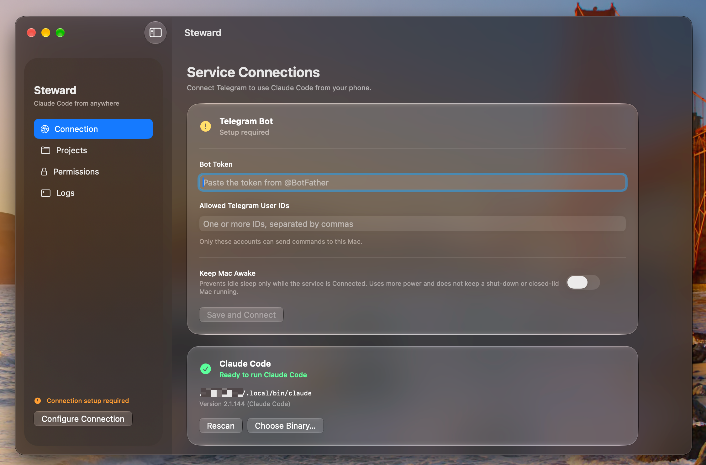

**English** · [简体中文](README.zh.md) · [日本語](README.ja.md)

<p>
  
</p>

# Steward

Drive Claude Code on your Mac from Telegram on your phone.

You send a message while away from your desk; Claude Code works on the Mac; approval requests land back on your phone.



## Read First

**Anyone who can message your Steward bot can run commands on your Mac.**

Steward runs outside the macOS sandbox and acts as your user account. Use it only with a private Telegram bot, keep the bot token secret, and keep the Telegram user ID allow list strict.

Full safety, privacy, setup, usage, and limitation notes are on the [Safety & Privacy page](privacy.html).

## Steward vs. Remote Control and Dispatch

| | Steward | [Remote Control](https://code.claude.com/docs/en/remote-control) | [Dispatch](https://claude.com/docs/cowork/guide/dispatch) |
|---|---|---|---|
| Claude Code login | **Any**: subscription, API key, Bedrock, Vertex AI, company gateway | claude.ai subscription only | Pro / Max only |
| Start a new session from your phone | ✅ | ❌ Continues a session opened on the Mac | ✅ |
| Switch projects from your phone | ✅ `/project` | ❌ | ✅ |
| Run shell commands directly | ✅ `!git status` | Through Claude | Through Claude |
| Phone app | Telegram | Claude app / browser | Claude app |
| Runs on the Mac | Menu bar app | CLI, desktop app, or VS Code | Claude desktop app |

Steward never touches your Claude credentials; it runs `claude` as it is already signed in.

Compared as of September 2026.

## Requirements

- macOS 26.0+
- [Claude Code](https://claude.com/claude-code), installed and signed in
- A Telegram bot token and your own Telegram user ID

## Install

```bash
brew install --cask yusuke-114/tap/steward
```

To upgrade to the latest version:

```bash
brew upgrade --cask steward
```

To uninstall (use this instead of dragging the app to the Trash):

```bash
brew uninstall --cask steward
```

Or download the ZIP from [Releases](../../releases).

### Install fails with `App source '/Applications/Steward.app' is not there`

Steward was removed by dragging it to the Trash, so Homebrew still thinks it is installed. Run this to reinstall; your settings are kept:

```bash
brew uninstall --cask --force steward && brew install --cask yusuke-114/tap/steward
```

## Quick Setup

1. Create a bot with [@BotFather](https://t.me/botfather) and copy the token.
2. Get your numeric Telegram user ID from [@userinfobot](https://t.me/userinfobot).
3. Open Steward, add the token, allow-listed user ID, and a project folder.
4. Press **Connect**, then send `/status` from Telegram.

## Links

- [Safety & Privacy](privacy.html)
- [License](LICENSE)
